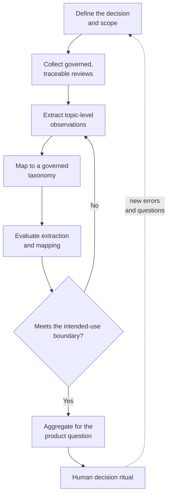
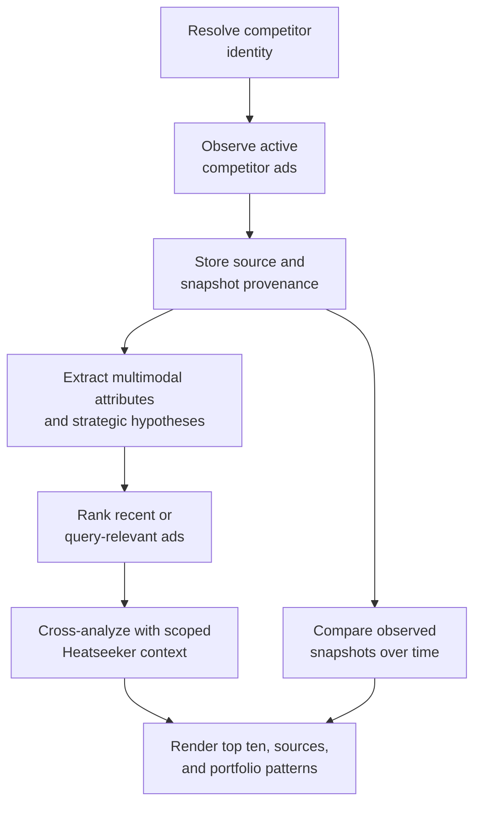

# Companion Lab: From App Reviews to a Product Instrument

Imagine joining HarborCart, a fictional marketplace app created for this chapter, as a product analyst. Thousands of Android reviews arrive over time. Some describe payments, refunds, search, login, delivery tracking, advertisements, customer support, or app performance. Others complain about sellers, couriers, prices, or policies the app team cannot directly control.

The team watches each new review arrive in a real-time Slack channel and reacts to individual problems as they appear. That keeps urgent pain visible, but it is poor at showing the larger picture: which product topics are becoming more negative, whether sentiment changed after a release or external event, whether differently worded complaints describe the same feature, and which themes fall within the product team's authority.

A human can read a sample. A traditional keyword system can count known phrases. A supervised machine-learning system can classify reviews after the team has created enough labeled examples and trained a model.

Generative AI creates another option: a PM can prototype a structured analysis pipeline without training a custom model first. That does not make the pipeline trustworthy by default. The PM has to turn a sequence of model calls into an evaluated product instrument.

## Start with the decision, not the model

The system exists to answer recurring product questions, not merely to “use AI to analyze reviews”:

- What proportion of reviews concerns each product area?
- Which areas contribute most to negative sentiment?
- How does sentiment within a category change over time?
- Which theme changed after a product release or external event?
- Which reviews require immediate human attention?
- Which topics are outside the product team's control?

Those questions determine the pipeline output. A useful first version might produce one structured row per extracted topic:

| Field | Purpose |
| --- | --- |
| `review_id` | Trace the output to the source review. |
| `review_date` | Analyze trends and events over time. |
| `topic` | Preserve a specific product issue or feature. |
| `category` | Group variable topic wording into stable product areas. |
| `sentiment` | Describe the expressed attitude toward that topic. |
| `explanation` | Support human review and debugging. |
| `prompt_version` | Reproduce and compare pipeline behavior. |
| `model_version` | Track model changes. |
| `needs_review` | Route uncertain or sensitive cases to a person. |

The schema makes the intended decisions inspectable before any prompt is written.

## The decision-to-instrument loop

The proof of concept turns one recurring decision into a seven-stage operating loop:



*Figure 20.1. The original decision-to-instrument loop separates scope, governed collection, extraction, taxonomy, evaluation, aggregation, and human use so a model output does not become a dashboard without a quality boundary.*

Every transition has a different quality question.

1. **Decision and scope:** Which recurring decision will use the output, and which complaints are outside that decision authority?
2. **Collection:** Is the input permitted, deduplicated, traceable, and representative enough for the claim?
3. **Extraction:** Are topic-level observations relevant, specific, nonredundant, and paired with the correct sentiment?
4. **Taxonomy:** Are categories stable, distinct, governed, and able to represent an unknown?
5. **Evaluation:** Do hard checks, labelled cases, and human review support the intended use?
6. **Aggregation:** Do counts and trends preserve denominators, versions, uncertainty, and source drill-down?
7. **Decision ritual:** Who reviews the instrument, what action can follow, and what evidence changes the system?

A demo shows that the calls run. An instrument shows that the outputs are reliable enough for a defined decision.

## Transfer the instrument: competitor-ad evidence

The app-review workflow is this chapter's primary worked instrument. The Heatseeker competitor-ad analyst tests whether the same pipeline logic transfers to a different data shape: multimodal third-party evidence with a strict identity boundary, source rights, and strategic inference.

At the surface, the result appears as a sub-agent response. Underneath, the stages remain inspectable:



*Figure 20.2. A competitor-ad response is trustworthy only when identity resolution, collection, provenance, extraction, retrieval, cross-analysis, and presentation remain separately inspectable.*

Chapter 13 owns the ambiguous-entity evaluation design, and Chapter 14 owns the resolver calibration. The transfer point here is that identity becomes an ingestion precondition: no creative enters the decision instrument until its advertiser page is selected or the system returns a review/no-match state.

The durable record must then keep several boundaries visible:

- source ad, advertiser, observation time, geography, and corpus status;
- media references and extracted copy, themes, offers, and formats;
- observed evidence separated from strategic hypotheses;
- prompt, model, embedding/index, and scoped-tenant context versions; and
- retrieval rights, retention, attribution, linking, and removal status.

Those fields constrain what the instrument may claim. “Recent” refers to an observation rule, “relevant” to a ranking rule, and “most used” or “changed” only to the collected corpus and snapshot schedule. None of those labels supports “best performing” without comparable outcome evidence.

The output preserves both evidence and synthesis: ten source-linked ads for inspection, plus portfolio patterns across the observed corpus. Product events can record invocation, completion, download, media inspection, and source-link opening; later slide-deck export shows demand for portability. These behaviors reveal use of the instrument, not whether its marketing interpretation changed a decision.

This comparison shows where the shared pipeline stops being generic. App reviews are first-party text the product can classify into a governed taxonomy. Competitor ads introduce multimodal extraction, external identity, corpus coverage, trademark/copyright, platform terms, and inferences about another organization's strategy. The stages transfer; the evaluation and governance contracts do not transfer unchanged.

## Why start with GenAI rather than a custom classifier

Classical supervised machine learning remains a strong option for stable, high-volume classification problems. If the organization has a mature labeled dataset, a fixed taxonomy, ML expertise, and strict cost or latency requirements, a trained classifier may be more predictable and efficient.

Generative AI is attractive for the proof of concept because it can:

- Interpret varied natural-language descriptions.
- Produce structured output from a small number of instructions and examples.
- Extract previously unseen topic wording.
- Explain why it chose a topic or category.
- Let the PM iterate on scope before committing to a fixed training pipeline.

The tradeoff is variability in both extraction and language. Topic names can drift, similar issues can receive different descriptions, and the model can include irrelevant problems, invent distinctions, or force a review into a category that does not fit. Those are product-quality failures, not cosmetic differences in wording.

GenAI reduces the cost of the first prototype. It does not remove the need for labels, evaluation, and data engineering if the workflow becomes operational.

## Define the extraction task precisely

The first prompt often produces something that looks reasonable:

```json
[
  {
    "topic": "refund failure",
    "sentiment": "negative"
  }
]
```

At scale, “reasonable” is not a quality definition. The PM must decide:

- What counts as a product topic?
- How specific should the topic be?
- Can one review produce multiple topics?
- When should the model return no topic?
- Is sentiment assigned to the whole review or each topic?
- How should mixed sentiment be handled?
- Which issues are outside the team's scope?
- What explanation is required for review?

For a marketplace app, a courier arriving late may be outside the app product team's direct control, while incorrect in-app delivery status is a product topic. A rude seller may be an operations or trust-and-safety issue, while an inability to report the seller may be a product issue. The boundary is a product decision, not a generic language-model fact.

## A stronger extraction contract

An extraction prompt should separate stable instructions from the review input.

```text
Role:
You are analyzing HarborCart mobile-app reviews for a product team.

Goal: Extract product topics that the app team can investigate and trend over time.

Rules:
- Return zero to three topics.
- Each topic must name a specific feature, workflow, state, or app-quality issue.
- Do not extract seller attitude, courier speed, or general price dissatisfaction
  unless the review describes an app behavior connected to it.
- Do not return two topics that describe the same issue.
- Assign sentiment to each topic, not the review as a whole.
- If no in-scope topic exists, return an empty array.

Output:
Return JSON matching the supplied schema.

Verification:
For each topic, include a short explanation grounded in the review text.
```

The exact wording will change. The durable improvement is that relevance, scope, redundancy, abstention, and output structure are explicit.

## Build the evaluation set before scaling

Do not run the prompt across ten thousand reviews and inspect only a few attractive examples. Create a labeled evaluation set.

The set should include:

- Common product topics.
- Rare but important issues.
- Reviews with no in-scope topic.
- Multiple topics in one review.
- Mixed sentiment.
- Sarcasm or ambiguous language.
- Very short reviews.
- Reviews in supported languages or language mixtures.
- Seller and courier complaints that test the scope boundary.
- Sensitive or safety-related content.

For each review, a human annotator records the expected topics, category if known, sentiment, and whether the example should be escalated. Split the data by purpose:

- **Development set:** inspect errors and improve the prompt.
- **Test set:** evaluate the selected prompt on examples not used during iteration.
- **Production sample:** monitor whether real inputs differ from the curated set.

Calling the first set “training data” can be misleading when the model is not being trained. It is prompt-development and evaluation data.

## Measure the errors that matter

One accuracy number hides too much. Use a small set of task-specific measures:

### Topic relevance

Of the topics the model extracted, how many are valid, in-scope product topics? Low relevance creates noise and false priorities.

### Topic coverage

Of the valid topics humans identified, how many did the model capture? High relevance with poor coverage produces a clean but incomplete picture.

### Redundancy rate

How often does the model produce two labels for the same issue in one review?

### Sentiment agreement

How often does topic-level sentiment match the human label?

### Abstention quality

How well does the model return no topic when the review is outside scope or contains no actionable product signal?

### Category mapping accuracy

How often does an extracted topic map to the expected category?

### Human-review rate

What proportion of outputs require manual resolution, and for which error types? The required threshold depends on use.

A directional discovery dashboard can tolerate more uncertainty than an automated escalation workflow or executive performance report. The PM should define whether the instrument is exploratory, operational, or decision-grade.

## Iterate from an error taxonomy

Prompt iteration becomes professional when each change targets an observed failure. Create an error table:

| Error type | Example | Likely cause | Proposed change | Regression risk |
| --- | --- | --- | --- | --- |
| Irrelevant topic | “Courier was late” | Scope boundary missing | Add out-of-scope rule and empty-output option | May hide tracking complaints |
| Duplicate topics | “Refund failed” and “Unable to refund” | No deduplication instruction | Compare topics before returning | May merge distinct refund issues |
| Wrong sentiment | Current praise follows past complaint | Whole-review sentiment | Assign sentiment per topic and current state | May miss historical pain |
| Topic too broad | “App issue” | Specificity undefined | Require feature, flow, or state | May over-fragment categories |
| Forced category | Novel issue placed in nearest bucket | No unknown path | Add `other_review` or human-review route | May increase manual work |

After diagnosing the error class, make one controlled prompt change and rerun the full evaluation set rather than assuming improvement from three repaired examples. A new instruction can fix one failure while creating another, so every meaningful change needs a version and a comparable result.

```text
prompt_v1 -> baseline
prompt_v2 -> topic specificity and structured output
prompt_v3 -> abstention, scope boundaries, and redundancy control
```

The version names matter because downstream trends are difficult to interpret when the measurement instrument changes silently.

## From variable topics to stable categories

Even a good extractor may produce many labels:

- `refund not available`
- `refund button disabled`
- `minimum refund balance`
- `refund stuck`
- `refund delayed`

The detail is useful for diagnosis. It is inefficient for trend reporting.

Categories create a more stable product vocabulary, such as:

- Refunds.
- Payments.
- Search and discovery.
- Login and account access.
- Delivery tracking.
- Promotions.
- Advertising.
- App performance.
- Customer support.

An LLM can propose categories from a sample of topics. The product team must review the result.

A useful category should:

- Describe one product area or decision domain.
- Have a clear inclusion and exclusion rule.
- Be distinct enough from neighboring categories.
- Remain stable long enough for trend comparison.
- Allow an unknown or review path.
- Map to a team or product question someone can act on.

A useful vocabulary is stable enough to support decisions without erasing meaningful differences; it need not be a perfect taxonomy.

## Mapping needs its own evaluation

After categories exist, map each extracted topic to one category from the approved list. The mapping prompt should not invent new categories silently.

```text
Map the topic to one category from the supplied category definitions.

If no category fits with sufficient confidence, return `needs_review`.

Output:
{
  "topic": "...",
  "category": "...",
  "explanation": "...",
  "needs_review": true | false
}
```

Evaluate mapping on a labeled sample, including ambiguous boundary cases.

Watch for categories that attract unrelated topics, then determine whether the extractor is producing vague labels or the taxonomy itself has an overbroad boundary. The evaluation loop must be able to change either layer without hiding which intervention produced the result.

## Run the end-to-end pipeline

Once extraction and mapping are good enough for the intended use, run the full sequence:

```text
review ingestion
-> cleaning and deduplication
-> topic and sentiment extraction
-> category mapping
-> quality and review flags
-> storage
-> aggregation
-> visualization
```

Keep the source review and version metadata. A dashboard point should be traceable back to the reviews and model outputs that produced it.

Useful visualizations include:

- Topic volume by category.
- Positive, neutral, and negative distribution within each category.
- Sentiment trend over time.
- Category trend around releases or external events.
- Low-confidence and human-review volume.
- Pipeline quality metrics by prompt and model version.

The product dashboard and the pipeline-quality dashboard serve different purposes. Do not hide instrument degradation behind a stable business chart.

## A proof of concept is not yet a product instrument

A notebook or script can demonstrate the sequence. Production requires a system around it:

| Production boundary | What has to become routine |
|---|---|
| Ingestion | Scheduled or event-driven collection, deduplication, source identity, recovery, and monitoring |
| Governance | Retention, access, redaction, provider handling, and deletion |
| Versioning | Prompt, schema, taxonomy, model, and output lineage |
| Evaluation | Maintained labeled sets, regression runs, production sampling, and judge-to-human calibration |
| Human review | Escalation for low confidence, novelty, safety, sensitivity, and high-impact cases |
| Economics | Token and model cost, retries, latency, and time to available insight |
| Maintenance | Drift, unknown language, declining coverage, and taxonomy changes |
| Decision ritual | Named reviewers, cadence, and actions; otherwise the dashboard is only a visualization |

## Decide whether to stop, improve, or productionize

The proof of concept should end with one of four decisions.

**Stop:** The quality is too low, the business question is weak, or the manual process is sufficient.

**Improve:** The workflow shows value, but a specific quality or scope problem needs another iteration.

**Productionize:** The output answers a recurring question at an acceptable quality, and the operational investment is justified.

**Pivot:** The pipeline revealed a more useful task, such as routing urgent issues rather than building a broad sentiment dashboard.

The ability to build the workflow is not the reason to keep it.

## PM checklist: AI analysis pipeline

- The recurring product decision is explicit.
- Input provenance and permissions are understood.
- The output schema supports traceability and versioning.
- Scope and abstention rules are defined.
- A labeled development and test set exists.
- Relevance, coverage, redundancy, sentiment, abstention, and mapping are evaluated separately.
- Prompt changes target observed error types.
- Categories have inclusion and exclusion definitions.
- Ambiguous cases can reach human review.
- Business trends can be traced to source reviews.
- Pipeline quality is monitored separately from product trends.
- Privacy, cost, latency, failure recovery, and drift are addressed.
- A real team ritual uses the output to make decisions.

## Chapter exercise: design a product instrument

Choose a manual, text-heavy product workflow. Write:

1. The recurring decision it should support.
2. The input source and permission boundary.
3. The structured output schema.
4. The stages in the pipeline.
5. Five evaluation examples, including one no-output case.
6. The quality measures that matter.
7. The first error taxonomy.
8. The human-review path.
9. The product questions the final dashboard should answer.
10. The criteria for stop, improve, productionize, or pivot.

The pipeline is not valuable because an LLM sits inside it. It is valuable when the team can trust it enough to see product reality more clearly and act with better judgment.

Choosing to productionize the instrument creates a delivery obligation rather than completing the work. Chapter 20 carries that obligation through implementation, review, exposure, measurement, and the boundary record that preserves what actually shipped.

## Evidence and source note

**Firsthand account:** The original prompt-development and practice-data application is preserved in dated July–August 2024 artifacts, including Prompt V2/V3 code, train/test splits, labelled evaluation sheets, and topic-category mapping.

**Constructed teaching example:** HarborCart, its reviews and labels, the publication prompt, figures, and companion dataset were created for this book so readers can inspect and rerun the workflow without depending on private source material.

**External source/framework:** The earlier workshop and raw app-review corpus remain provenance inputs. Readers work with the synthetic HarborCart case and companion dataset presented here.

**Recommended practice:** Evaluation, taxonomy governance, human review, ingestion rights, privacy, cost, drift, and decision rituals require specialist adaptation before production use.
